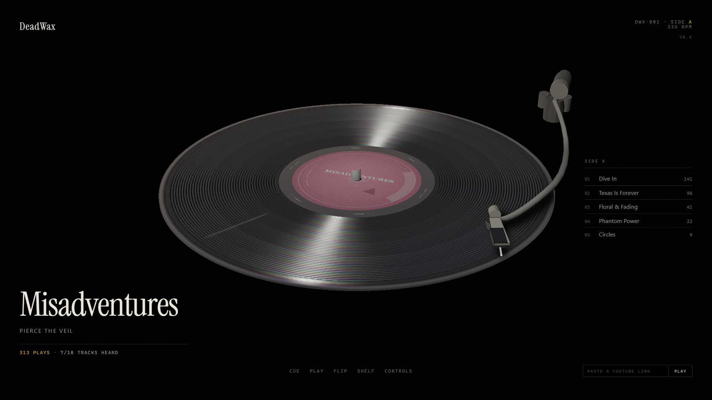
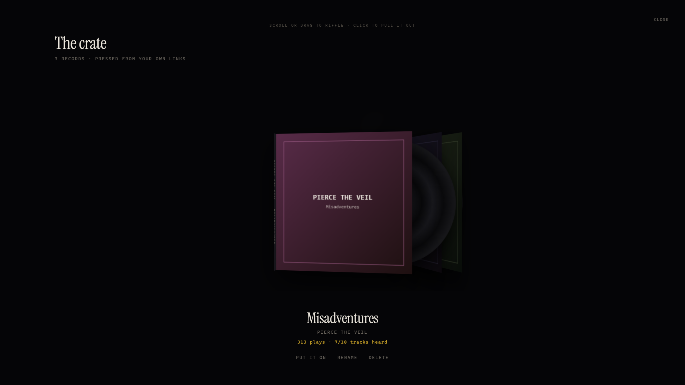

# DeadWax

**A record that wears where you played it.**

Every groove on a real record degrades in proportion to how many times a stylus has crossed it. Play one track to death and you can see it — that band goes milky while the rest of the disc stays mirror-black. DeadWax renders that, driven by your actual listening history.

It is one self-contained HTML file. No build step, no server, no account.

**→ [codedrichy.github.io/DeadWax](https://codedrichy.github.io/DeadWax/)**

---

## What it does

**The wear is real data.** Bands are laid out by track duration and shaded by play count on a log curve, normalised against both the record's own range and an absolute reference. A track played 141 times and one played 9 times do not look alike.

The scatter is deliberately **view-independent** — worn vinyl is micro-scratched, and micro-scratches scatter diffusely, so a played band reads as worn from every angle rather than only where the specular highlight happens to fall. That was the difference between the wear being the point and the wear being invisible.

**Bring your own history.** Drop in a Spotify extended-history export, a Spotify `StreamingHistory*.json`, an Apple Music CSV, or a Google Takeout `watch-history.json`. Plays count at 30 seconds — Spotify's own stream threshold — so skips do not wear grooves. Everything is parsed in the page; no file leaves your machine.

**Or paste a YouTube link.** It looks the track up, presses a record, and plays it. The needle is driven by the player's clock, so dragging the tonearm seeks the video and scrubbing the video moves the needle.

**Riffle the crate.** Records stand on edge, packed and leaning. Scroll, drag, or arrow through them and pull one out.

---

## The physical model

The parts that are easy to fake are the parts that give a render away, so they are not faked:

- **The flip** is a rigid-body turn of the record — it rises clear of the spindle, rotates about its own diameter, and settles. The camera does not move. The face swaps at the *measured* edge-on angle (−33.5° at the default rake, solved from the camera basis), not at 90°, where the disc is actually more face-on than flat.
- **The tonearm** is a swept S-arm with a real gimbal, closed headshell, and per-face backface culling with painter's-algorithm depth sorting.
- **The pressing is off-centre** by ~0.7 mm, so the disc orbits the spindle once per revolution, like every record ever made.
- **Sides split by time, not by count** — 22 minutes a side, which is what a 12″ at 33⅓ actually holds. A record that fits on one side is honestly one-sided.
- **Surface noise** is modelled from measurements: a floor near −48 dB, dominated by content *below* 100 Hz. It is rumble, not hiss.

---

## Where it is going

This page is the demo. The product is a **desktop app** — one that sits on your machine, watches what you are actually playing, and presses the record as you listen: no export to upload, no link to paste. The wear arrives on its own, over months, the way it does on a real shelf.

The web build exists because the surface had to be proved first. Whether wear reads as wear, whether the flip feels like an object, whether a stranger understands the disc without a legend — those are the same questions in a window on your desktop, and they are cheaper to answer in a page you can send someone.

---

## How it is checked

The render is verified by measurement, not by eye. `scripts/verify/` holds the harness: boot and dead-binding checks, twenty interaction assertions, the side split and flip arc, the edge-on angle solved from the camera basis, needle position against the player clock, and wear values across a play-count spread.

---

## Privacy

`deadwax-data.js` — a personal listening history with embedded album art — is gitignored and never published. GitHub Pages serves the branch tree publicly, so anything tracked is public.

The shipped build stores your crate in `localStorage` only. It has no backend, no analytics, and no account.

---

## Licence

**All rights reserved.** See [LICENSE](LICENSE).

This is not open source. No permission is granted to copy, modify, distribute, fork, re-host, or use this code or its design — including as training data for machine learning models. Viewing the repository, or viewing source on the live page, grants you no rights to it.

If you want to use any of it, ask: [github.com/CodedRichy](https://github.com/CodedRichy)

> **Note on forking.** GitHub's Terms of Service grant every user the right to view and fork any public repository, regardless of its licence. This repository is public by choice, so that is a trade made knowingly: the licence removes permission to *use* the work, not the ability to copy it. The same is true of the live page — it is a single client-side HTML file, so its full source is readable in any browser. Readable is not licensed.

### Third-party material

Not covered by the above, and under their own terms:

- **[Instrument Serif](https://fonts.google.com/specimen/Instrument+Serif)** by Rodrigo Fuenzalida — SIL Open Font License 1.1.
- **The record icon** (`favicon-*.png`, `apple-touch-icon.png`) is derived from a third-party stock illustration, not original work. `scripts/make-favicon.js` masks it to a real alpha channel — the source JPEG's "transparency" is a checkerboard painted into the pixels. Check the stock licence before relying on it.
- **Album titles, artist names, and cover art** shown at runtime belong to their rights holders. They are fetched by the viewer's browser and are neither stored in nor distributed with this repository.
